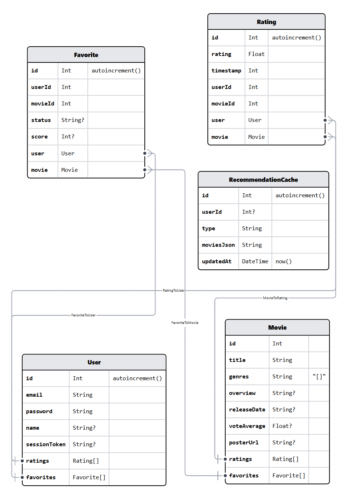
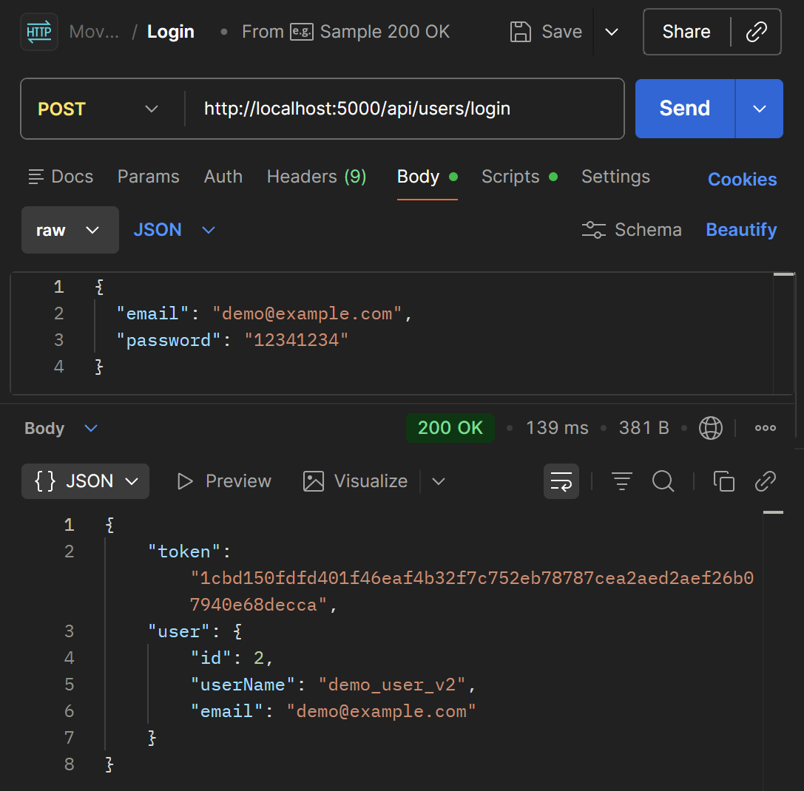

#  MovieNest 🎬

A full-stack web application for discovering movies, tracking favorites, and getting personalized recommendations powered by a hybrid ML recommendation engine.

## Tech Stack

| Layer | Technology |
|---------|-------------|
| Backend | Node.js + Express.js |
| Database | SQLite with Prisma ORM |
| Frontend | Vanilla HTML, CSS, JavaScript (SPA) |
| ML Service | Python – Content-based, Collaborative & Popularity filtering |

## Setup & Installation

### 1. Requirements
- Node.js 18+
- Python 3.10+ (for the ML recommendation service)

### 2. Install Backend Dependencies

```bash
cd backend
npm install
```

### 3. Environment Configuration

Copy the example env file and fill in your values:

```bash
cp backend/.env.example backend/.env
```

Example `.env` content:
```env
DATABASE_URL="file:./prisma/dev.db"
PORT=5000
```

### 4. Python Environment Setup

```bash
cd ml-service
python -m venv venv
source venv/bin/activate        
pip install -r requirements.txt
```

### 5. Database Initialization

```bash
cd backend
npx prisma migrate dev --name init
```

### 6. Data Seeding

CSV dataset files (`ml-service/data/`) are included in the repository. Simply run:

```bash
cd backend
npm run seed
```

### 7. Start the Application

```bash
cd backend
npm start
# or for development with hot reload:
npm run dev
```

The application will be available at **http://localhost:5000**

---

## Database Schema

Prisma ORM manages the SQLite database. Below is the visual schema:



---

## Project Structure

```
MovieNest/
├── backend/
│   ├── src/
│   │   ├── controllers/
│   │   │   └── userController.js
│   │   ├── routes/
│   │   │   ├── favorites.js
│   │   │   ├── movies.js
│   │   │   ├── recommendations.js
│   │   │   └── user.js
│   │   ├── middleware/
│   │   │   ├── auth.js
│   │   │   ├── errorHandler.js
│   │   │   └── validate.js
│   │   ├── lib/
│   │   │   └── prisma.js
│   │   ├── utils/
│   │   └── app.js
│   ├── prisma/
│   │   ├── migrations/
│   │   ├── schema.prisma
│   │   └── seed.js
│   ├── .env.example
│   ├── package.json
│   └── package-lock.json
├── frontend/
│   ├── index.html
│   ├── css/
│   │   └── style.css
│   ├── js/
│   │   ├── api.js
│   │   ├── app.js
│   │   ├── auth.js
│   │   ├── components.js
│   │   ├── config.js
│   │   └── views.js
│   └── assets/
│       └── image.png
├── ml-service/
│   ├── movie_reco/
│   │   ├── __init__.py
│   │   ├── collaborative.py
│   │   ├── content.py
│   │   ├── io.py
│   │   └── popularity.py
│   ├── data/               
│   ├── api_cli.py
│   ├── model_cache.py
│   └── requirements.txt
├── docs/
│   └── DatabaseSchema.png
├── .gitignore
└── README.md
```

---

## RESTful API Endpoints

| Method | Path | Auth Required | Description |
|--------|------|:---:|------|
| GET | `/api/movies` | No | List movies (pagination, search) |
| GET | `/api/movies/stats` | Optional | App stats + optional personal avg rating |
| GET | `/api/movies/:id` | No | Movie details |
| GET | `/api/recommendations/popular` | No | Top movies globally |
| GET | `/api/recommendations/personalized` | Yes | Personalized recommendations |
| GET | `/api/recommendations/random` | No | Random movie picker |
| GET | `/api/recommendations/genre` | No | Movies by genre |
| GET | `/api/recommendations/movie/:id` | No | Similar movies by ID |
| GET | `/api/favorites` | Yes | User's tracked movies |
| POST | `/api/favorites` | Yes | Add/update tracked movie status & score |
| PATCH | `/api/favorites/:movieId` | Yes | Update tracked movie status & score |
| GET | `/api/favorites/:movieId/check`| Yes | Check if movie is favorited |
| DELETE | `/api/favorites/:movieId` | Yes | Remove movie from list |
| POST | `/api/users/register` | No | Create an account |
| POST | `/api/users/login` | No | Sign in |
| GET | `/api/users/me` | Yes | Get current user profile |
| PUT | `/api/users/update` | Yes | Update user profile |
| PUT | `/api/users/change-password` | Yes | Change user password |

---

## Postman Testing

You can use Postman to test the API endpoints. Click below to view example screenshots.

<details>
<summary>Register Success (201)</summary>


</details>

<details>
<summary>Login Success (200)</summary>



</details>

<details>
<summary>Get Movies by Genre</summary>


</details>

<details>
<summary>Get Popular Recommendations</summary>


</details>
---

## ML Recommendation Engine

The `ml-service` module provides three recommendation strategies:

- **Content-based** (`content.py`) – recommends movies similar to what the user has liked, based on genres, cast, and keywords
- **Collaborative filtering** (`collaborative.py`) – recommends based on patterns from similar users
- **Popularity-based** (`popularity.py`) – surfaces trending and top-rated movies globally

Results are cached via `model_cache.py` to avoid re-computing on every request.

---